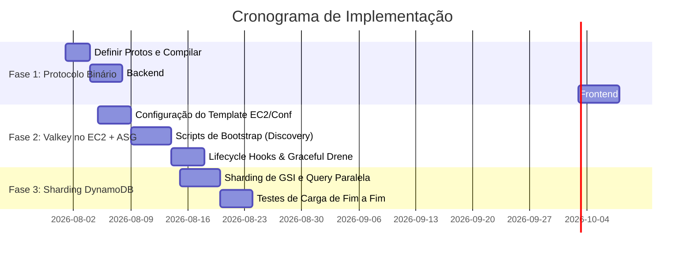

# Plano de Implementação: Escalabilidade, WebSocket Binário e Valkey no EC2 + ASG

Este documento apresenta o plano de ação detalhado para implementar as melhorias de escalabilidade, a migração dos
WebSockets para formato binário e a arquitetura do Valkey rodando sobre AWS EC2 e Auto Scaling Groups (ASG).

---

## 🎯 Objetivos

1. **WebSocket Binário**: Migrar o protocolo de comunicação de JSON para um formato binário (com análise comparativa
   entre **Protobuf** e **MessagePack**).
2. **Valkey no EC2 + ASG**: Desenhar e implementar o cluster Valkey escalável em servidores EC2 auto-gerenciados.
3. **Partition Sharding no DynamoDB**: Implementar sharding na listagem de salas para evitar hot partitions.

---

## 🏎️ Parte 1: Protocolo WebSocket Binário

Substituir o JSON por um formato binário reduz drasticamente o tamanho das mensagens (o snapshot de poker é redundante e
contém chaves de texto repetidas), diminuindo o custo de CPU para serialização/deserialização (Go e JS) e a banda de
rede do servidor e dos clientes (principalmente mobile).

### Opção A: Protocol Buffers (Protobuf) - *Recomendado para Máxima Performance*

* **Vantagens**: Tamanho de payload mínimo (tipagem forte binária), geração automática de código para Go e TypeScript,
  validação rígida de esquema.
* **Desvantagens**: Exige compilação manual dos arquivos `.proto` toda vez que a estrutura do jogo mudar.

### Opção B: MessagePack (MsgPack) - *Recomendado para Migração Rápida*

* **Vantagens**: Sem esquemas (drop-in replacement para as structs atuais). Pode ser integrado em poucas linhas
  substituindo `json.Marshal`/`json.Unmarshal` por `msgpack.Marshal`/`msgpack.Unmarshal` (Go e JS).
* **Desvantagens**: Ligeiramente maior em tamanho que o Protobuf (as chaves ainda podem ser serializadas, a menos que
  serializado como arrays posicionais).

### 🛠️ Passos de Implementação (Protobuf)

1. **Definição de Esquemas (`.proto`)**:
   Criar um diretório compartilhado `/proto` e definir os contratos:
   ```protobuf
   syntax = "proto3";
   package poker;
   
   message Card {
     string rank = 1;
     string suit = 2;
   }
   
   message Seat {
     int32 seat_index = 1;
     string player_id = 2;
     string name = 3;
     int64 stack = 4;
     string state = 5; // "active", "folded", etc.
     repeated Card hole_cards = 6;
   }
   
   message TableSnapshot {
     string table_id = 1;
     string stage = 2;
     repeated Card board = 3;
     repeated Seat seats = 4;
     string current_player_id = 5;
     int64 total_pot = 6;
   }
   
   message ServerMessage {
     string type = 1; // "state", "chat", "error"
     TableSnapshot snapshot = 2;
     string error_code = 3;
   }
   ```
2. **Backend**:
    - Compilar os protos com `protoc --go_out`.
    - Em `api/internal/api/v1/tablews.go`, trocar `conn.WriteMessage(fws.TextMessage, data)` por
      `conn.WriteMessage(fws.BinaryMessage, protoBytes)`.
3. **Frontend**:
    - Compilar os protos com `ts-proto` ou similar para gerar os types e decodificadores JS.
    - Em `useTableRealtime.ts` e `@aoctech/ws-client`, configurar o WebSocket para ler `Blob` ou `ArrayBuffer` (
      `ws.binaryType = 'arraybuffer'`) e decodificar os bytes para objetos TypeScript.

---

## 🗄️ Parte 2: Valkey no AWS EC2 + ASG (Sem ElastiCache)

Rodar Valkey autogerenciado em EC2 sob um Auto Scaling Group (ASG) exige lidar com o fato de que nós Valkey em Cluster
mantêm estado (tabela de hash slots e IPs dos nós). Ao escalar o ASG (scale-out ou scale-in), o cluster precisa se
auto-ajustar.

### 📐 Arquitetura do Cluster Valkey no ASG

Para evitar a perda de dados e instabilidade durante o auto-scaling, utilizaremos a topologia **Valkey Cluster Mode
Enabled**:

* **Topologia Mínima**: 6 nós EC2 (3 Primários, 3 Réplicas) distribuídos em 3 Zonas de Disponibilidade (AZs).
* **ASG de Nós de Controle**: Mantemos um ASG com tamanho fixo de instâncias (ex: 6 nós permanentes para a base do
  cluster).
* **ASG de Auto-scaling (Opcional para Pub/Sub de leitura)**: Se precisarmos escalar réplicas de leitura para Pub/Sub,
  as novas instâncias do ASG entram como **Read-Only Replicas** no cluster.

```mermaid
graph TD
    ALB[Application Load Balancer] --> API1[API Go - Instância 1]
    ALB --> API2[API Go - Instância 2]
    
    subgraph Valkey Cluster (EC2 + ASG)
        V1[Valkey Primary AZ-A] <--> V2[Valkey Replica AZ-B]
        V3[Valkey Primary AZ-B] <--> V4[Valkey Replica AZ-C]
        V5[Valkey Primary AZ-C] <--> V6[Valkey Replica AZ-A]
    end
    
    API1 <--> ValkeyCluster[Valkey Cluster Nodes]
    API2 <--> ValkeyCluster
```

### ⚙️ Mecanismo de Inicialização e Descoberta Dinâmica (Bootstrap Script)

Como as instâncias no ASG podem morrer e ser substituídas por novos IPs, o bootstrap do Valkey precisa ser automatizado
usando **User Data** nas EC2:

1. **Service Discovery via AWS Tags / CLI**:
   Na inicialização, o script de User Data da EC2 descreve o ASG para obter os IPs privados de todos os outros nós
   Valkey ativos:
   ```bash
   # Obtém IPs dos nós Valkey do mesmo ASG usando AWS CLI
   NODES_IPS=$(aws ec2 describe-instances \
     --filters "Name=tag:aws:autoscaling:groupName,Values=valkey-cluster-asg" "Name=instance-state-name,Values=running" \
     --query "Reservations[*].Instances[*].PrivateIpAddress" \
     --output text)
   ```
2. **Configuração Dinâmica**:
   O script monta o arquivo `/etc/valkey/valkey.conf` habilitando o modo cluster:
   ```ini
   port 6379
   cluster-enabled yes
   cluster-config-file nodes.conf
   cluster-node-timeout 5000
   cluster-announce-ip <IP_PRIVADO_DA_EC2>
   cluster-announce-port 6379
   cluster-announce-bus-port 16379
   ```
3. **Cluster Meet Automation**:
    - Um nó orquestrador (ou o primeiro a subir) executa o comando `valkey-cli --cluster create` utilizando os IPs
      descobertos se o cluster ainda não existir.
    - Nós novos que sobem via ASG realizam um `valkey-cli cluster meet <ip-existente> 6379` e se registram como réplicas
      do nó primário correspondente.

### 🛡️ Tratamento de Terminação (Scale-In / Downscaling)

Para evitar corrupção de slots do cluster quando o ASG decide encerrar uma máquina:

1. Usar **Lifecycle Hooks** no ASG para capturar o evento `EC2_INSTANCE_TERMINATING`.
2. Executar um script de dreno (*Graceful Shutdown Hook*):
    - Se o nó a ser destruído for **Primary**: Transferir a liderança e os slots para o seu respectivo Replica (
      `valkey-cli cluster failover`).
    - Remover o nó do cluster usando `valkey-cli cluster forget <node-id>` para evitar que os nós sobreviventes tentem
      se comunicar com o nó destruído.
    - Sinalizar ao ASG a conclusão do Lifecycle Hook (`CONTINUE`).

---

## 🧭 Parte 3: Partition Sharding no DynamoDB

Para remover o limite de 3.000 RCU/s no GSI de salas públicas, implementamos a divisão de chaves de partição:

1. **Alteração no Modelo Room**:
    - Em `dynamo.go`, passamos a gravar `GSIPublic` escolhendo um shard pseudo-aleatório:
      ```go
      func publicIndexValue(r Room) string {
          if r.Visibility == "public" {
              // Distribui as salas em 10 partições físicas (public#0 até public#9)
              shard := len(r.ID) % 10
              return fmt.Sprintf("public#%d", shard)
          }
          return ""
      }
      ```
2. **Leitura Paralela no Handlers**:
    - Em `ListPublic`, em vez de fazer uma única query na chave `"public"`, fazemos queries simultâneas (paralelizadas
      em Go routines) nos shards de `public#0` a `public#9` e concatenamos os resultados na resposta.

---

## 📅 Cronograma Recomendado


