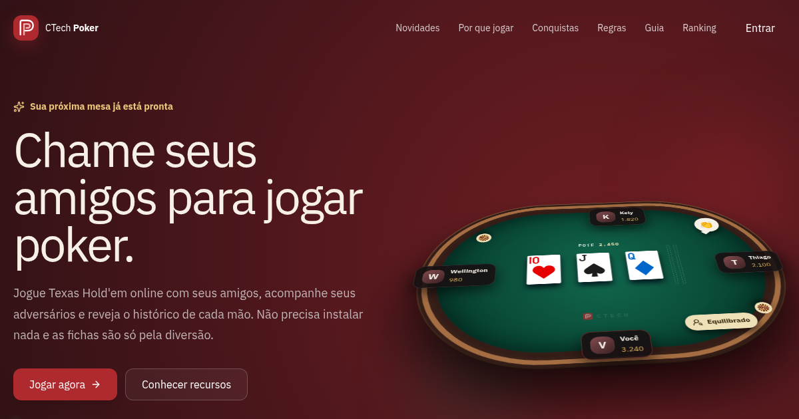
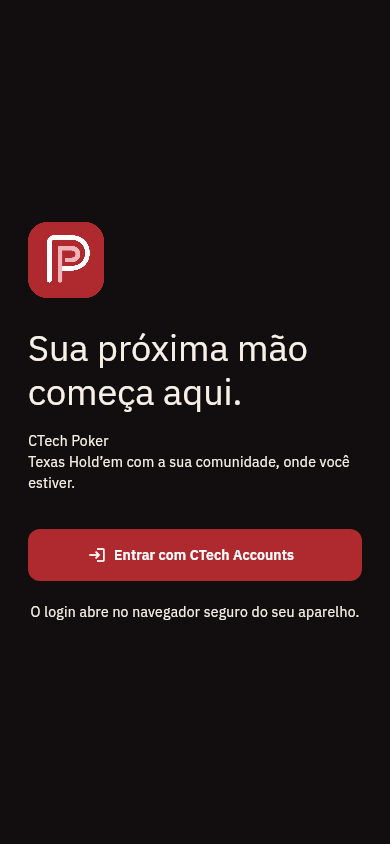
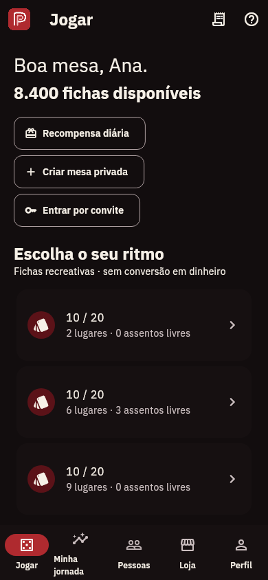
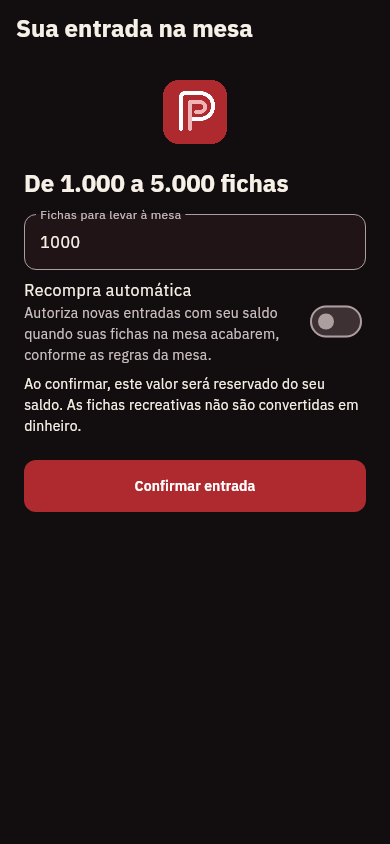
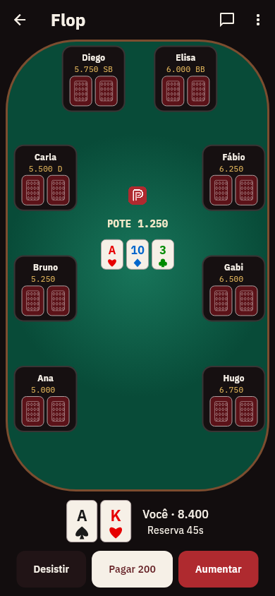

# Conferência da identidade visual — 2026-09-14

Referência: [design do Web](../../ui/DESIGN.md), [logo SVG](../../ui/public/svgs/logo.svg)
e [tokens CSS](../../ui/src/app/base.css). Implementação: [design mobile](../DESIGN.md).
A documentação anterior não havia comparado essas fontes com o aplicativo.

## Referência existente no Web

## Mobile corrigido

Imagens renderizadas pelos widgets Flutter reais com `PokerTheme.dark`, logo
local decodificada e fontes IBM Plex carregadas. Dados do lobby/mesa são fixtures.

| Login | Lobby |
|---|---|
|  |  |

| Entrada | Mesa |
|---|---|
|  |  |

## Conferido

- Monograma original com dois traços e proporções preservadas.
- Ação principal vermelha, sala vinho escura, textos claros e IBM Plex.
- Pagar/Passar claros, Aumentar vermelho e valores sobre feltro com contraste.
- Tema real compartilhado por aplicação e testes, sem seed dourada alternativa.
- Ícones nativos derivados do mesmo SVG; iOS sem canal alfa e Android adaptativo.

## Limites

São renders automatizados, sem sessão autenticada em produção e sem aparelhos.
Geometria, cartas ilustradas e cosméticos ainda requerem trabalho de paridade.
O golden do guia fica em `test/goldens/brand_guide.png`; texto ampliado em 2× é
verificado por testes de layout, não por uma aprovação de todas as telas.

Validação de build: APK debug compilado localmente com logo e fontes conferidas
no bundle. Análise estática limpa e 54 testes aprovados; iOS sem build local.
